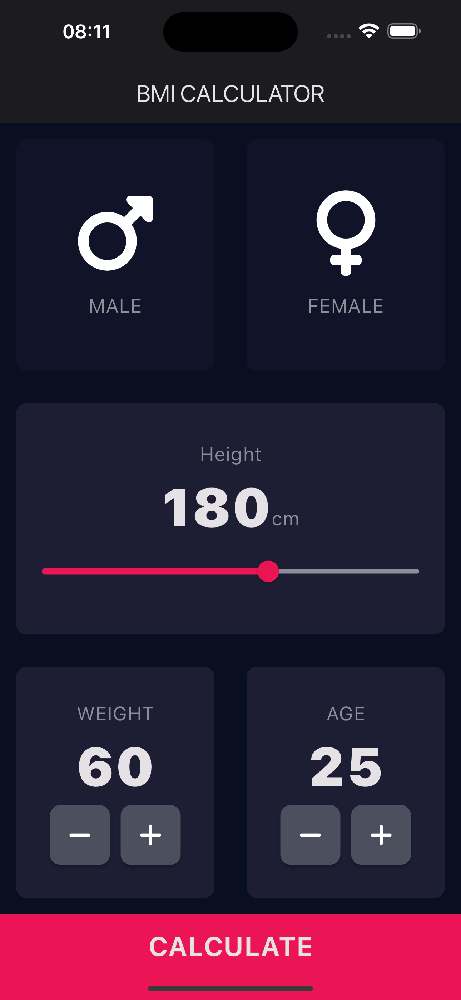
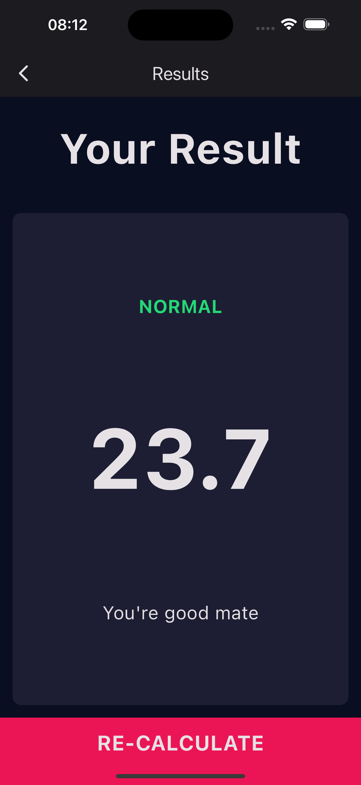

# BMICalculatorFlutter

A simple app to calculate Body Mass Index (BMI) made with flutter.

## Features
Calculate the BMI given the gender, height, weight and age in a simple and stylistic UI.

## Demo

